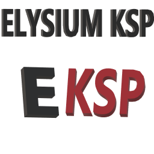
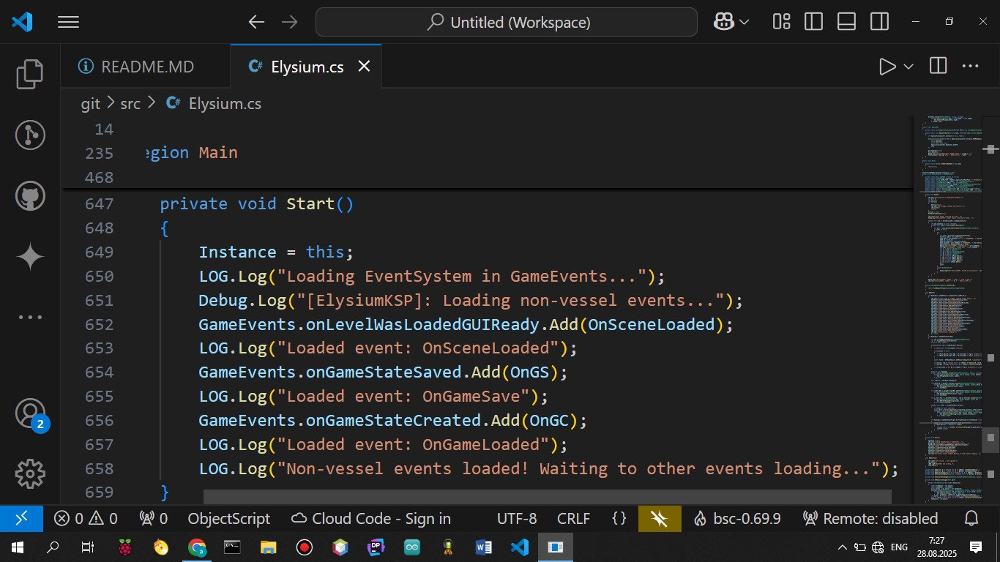
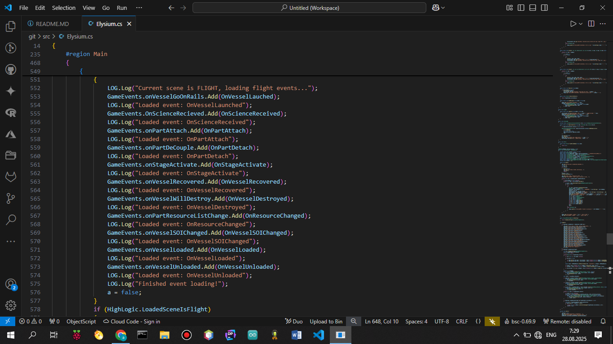
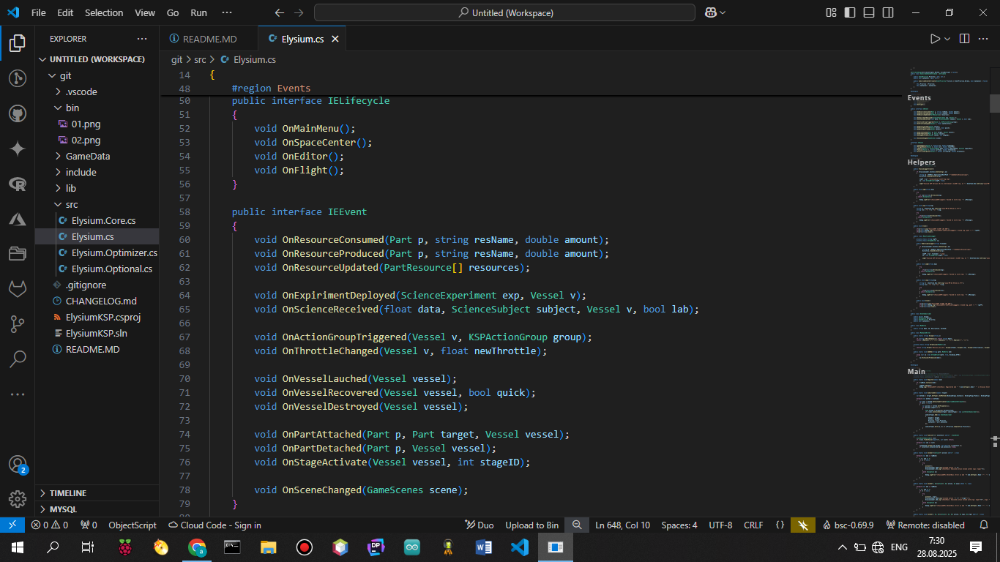

# ElysiumKSP A KSP core mod for you, mod developers!
### Intro
ElysiumKSP is a mod for easy developering mods for KSP 1.12.5 on C# 5 (.NET Framework 4.5). Based on Minecraft Forge 1.12.2. More code reprogrammed from MC Forge.

Mod provide a 28 events. For using implements event interfaces (IEEvent, IVessel, IELifecycle other). 

In new updates, im UARocketary possibly add ModuleManager code in ElysiumKSP (if you vote for this.).

### MDK Usage
For build you need have a Microsoft .NET v4.0.30319 with csc.exe and UnityEngine.dll from all needed UnityEngine.*************Module.dll
Implement mod dll (ElysiumKSP.dll) in own project and use. Post all bugs on aternoserror103@gmail.com or on github issues.

### !!!WARNING!!!
In starting KSP, Elysium load 3 events: OnSceneLoaded, OnGameSaved and OnGameLoaded. And after this, mod waiting for scene changing to Flight and init other events for Vessel(s).

## How to code in this.
To code mods on framework, you need to read API in *.cs files or copy examples from this. (Elysium.Events.cs not compiled in ElysiumKSP.dll!).
```csharp
using UnityEngine; // For all functions
using KSP; // For other
using ElysiumKSP.Mod; // Basic namespace with all classes to work from mods
using ElysiumKSP; // For more events

[KSPModElysium("own_mod_name", "description", "id")] // For load own mod in game
//[KSPAddon(KSPAddon.Startup.Flight, false)] // FOR LOAD SCENE SELECT
public class MySimpleMod : MonoBehaviour, IELifecycle // LifeCycle for scenes
{
    private bool loadedSceneMM = false;
    void Start()
    {
        EventBus.Register(this); // from ElysiumKSP!
        Debug.Log("[MySimpleMod]: Am loaded!!!");
    }

    void Update()
    {
        if (loadedSceneMM) Debug.Log("Current scene is MainMenu.");
    }

    public override void OnMainMenu() { loadedSceneMM = true; }
    public override void OnSpaceCenter() { /*own code*/ }
    public override void OnEditor() { /*own code*/ }
    public override void OnFlight() { /*own code*/ }
}
```

And compile mod with 
```C:\\Windows\\Microsoft.NET\\Framework\\v4.0.30319\\csc.exe -target:library MySimpleMod.cs /reference:ElysiumKSP.dll /reference:Assembly-CSharp.dll /reference:UnityEngine.dll /refernce:UnityEngine.CoreModule.dll```

Place in GameData folder and check, if in GameData you have a Elysium folder with this mod. Else own mod not run. :(

## Short API info
In mod API you have a 28 events. Screens for you


And interfaces with events

## API
If you read this, time to read all classes and interfaces in ElysiumKSP mod.

### KSPModElysium(modName, description, modId): System.Attribute
Attribute to mark own mod in ElysiumKSP ModLoader.

### IELifecycle
Interface with scene change realizations.

### IEEvent
Interface with all main events in ElysiumKSP. Watch fuctions in source files

### IVessel
Vessel event interface with vessel events.

### INetworkEvents
Interface with multiplayer for KSP, sure this is optional non-used in stock mods events, but... if you add multiplayer, use this events or make own.

### ElysiumLoader
Main mod class with mod loading, 

### Read more info in source files...